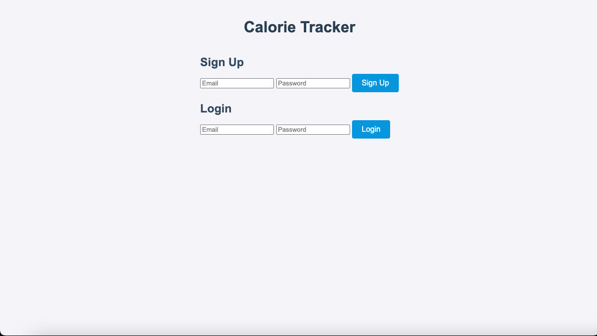
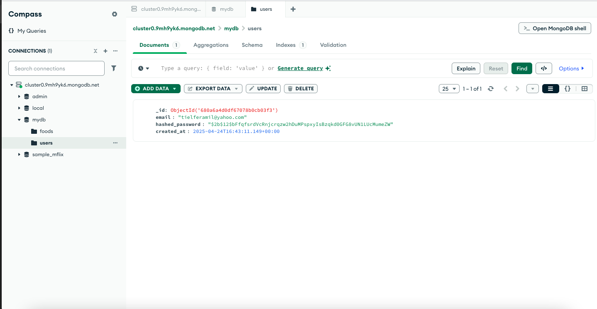
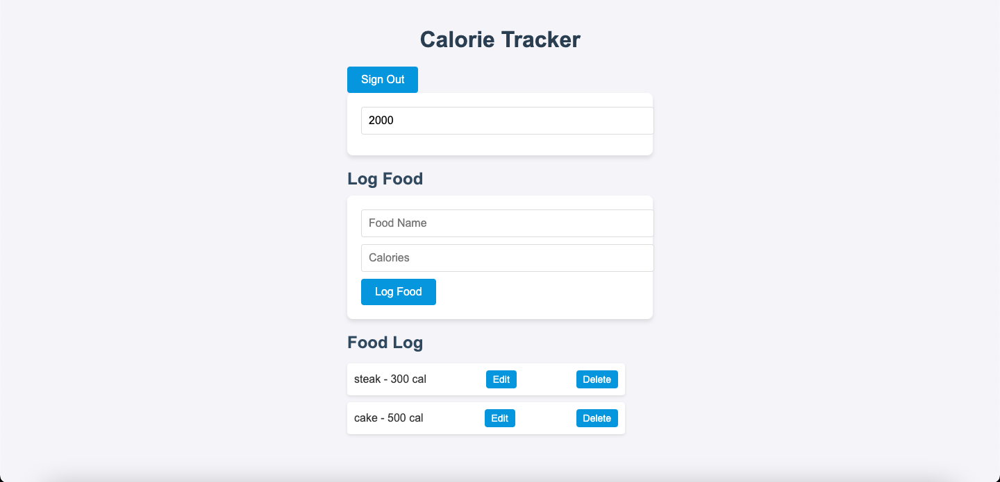
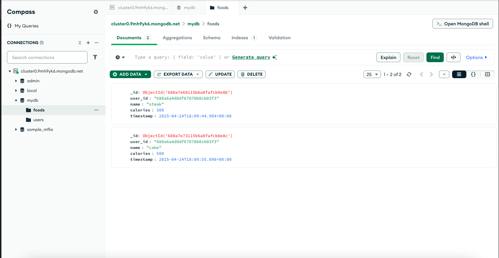

# Assignment 4: User Login
Users can now sign-up and log-in to with their email, although it does not implement a authentication to see wether it is real or not. 
It hashes the user passwords and saves the email and hashed password into MongoDB. There is a time limit on the JWT Token when it has expired
it will automatically sign you out. 

Users can sign out and set their caloric goals and log food items and the calories associated with it. Food and their calories go into the MongoDB database. Although setting a caloric goal and editing food calories
may not do anything, deleting food also deletes food in the MongoDB database. 

